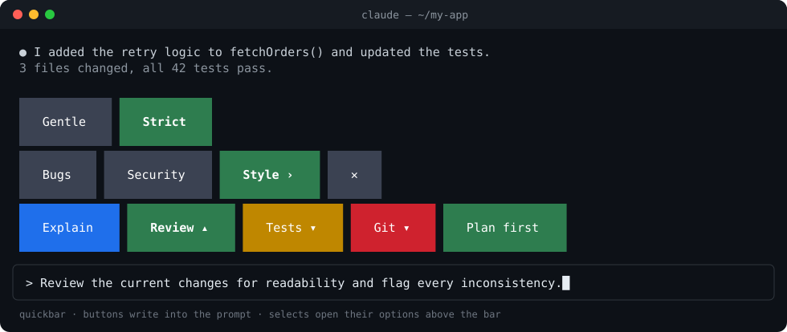

<div align="center">

# Claude Quickbar

**Big, colorful, configurable buttons above the Claude Code prompt.**

One JSON file turns the prompts you type every day into one-click buttons, and into nested selects that build a prompt step by step.

[](https://github.com/hugoamadio/claude-quickbar/actions/workflows/ci.yml)
[](LICENSE)
[](https://claude.com/claude-code)



</div>

## Why

You probably type the same handful of prompts all day: *explain this*, *review for bugs*, *run the tests and fix what fails*, *plan first*. Quickbar puts them one click away, in your own words, without leaving the prompt.

- **Buttons** write a prompt, or send it right away.
- **Selects** open their options above the bar, like a desktop menu: hover walks the levels, a click picks. Options can open more options, so a few moves compose a precise prompt.
- **One file** describes everything: labels, colors, text, where the text goes, and whether it is sent.
- **Live reload**: save the file and the bar updates. A broken file never breaks your session; the bar tells you what is wrong.

## Install

Requires Claude Code **2.1.287 or later** (mods are on by default).

```text
/plugin marketplace add hugoamadio/claude-quickbar
/plugin install quickbar@claude-quickbar
/reload-plugins
```

The bar appears with an example set of five buttons. Make it yours:

```text
/quickbar init
```

This writes the example to `~/.claude/quickbar.json`. Edit it and save; the bar updates by itself.

## Configure

```jsonc
{
  "$schema": "https://raw.githubusercontent.com/hugoamadio/claude-quickbar/main/schema/quickbar.schema.json",
  "style": { "size": "lg" },
  "buttons": [
    // A button: writes its text at the cursor.
    { "label": "Explain", "color": "#1f6feb", "hotkey": "e", "text": "Explain how this works, step by step: " },

    // A select: picking options composes "Review the current changes for readability and flag every inconsistency."
    {
      "label": "Review",
      "color": "#8957e5",
      "text": "Review the current changes",
      "options": [
        { "label": "Bugs", "text": "for correctness bugs" },
        { "label": "Style", "text": "for readability", "options": [
          { "label": "Gentle", "text": "and only flag what really matters." },
          { "label": "Strict", "text": "and flag every inconsistency." }
        ] }
      ]
    },

    // Sent right away instead of only written.
    { "label": "Run tests", "color": "#bf8700", "text": "Run the test suite and fix what fails.", "send": true }
  ]
}
```

The `$schema` line gives you autocompletion and inline errors in VS Code and any editor that reads JSON Schema.

### Where the config lives

The first file found wins:

| Order | File | Use it for |
|---|---|---|
| 1 | `<project>/.claude/quickbar.json` | Buttons for one repository, shareable with your team |
| 2 | `~/.claude/quickbar.json` | Your personal buttons, everywhere |
| 3 | bundled example | What you see right after installing |

### Buttons and selects

| Field | Type | Default | Description |
|---|---|---|---|
| `label` | string | required | What the button shows. |
| `text` | string | | A button: the text it writes. A select: a prefix before the chosen texts. |
| `options` | option[] | | Makes the button a select. |
| `color` | color | `style.color` | Background color. |
| `hotkey` | `a`–`z`, `0`–`9` | | Presses the button while the bar has focus. |
| `mode` | `insert` \| `append` \| `replace` | `insert` | Insert at the cursor, append to the end, or replace the prompt. |
| `send` | boolean | `false` | `true` submits the prompt; `false` only writes it so you can edit first. |
| `separator` | string | `" "` | Joins the prefix and the chosen texts of a select. |

### Options

| Field | Type | Description |
|---|---|---|
| `label` | string | What the option shows. Required. |
| `text` | string | Text this choice adds. A final choice without `text` adds its `label`. |
| `options` | option[] | Opens another level of choices (up to 6 levels). |
| `color` | color | Background color. |
| `mode`, `send` | | Override the button's values when this choice is the last one. |

A select writes once, when you reach a choice with no further `options`. The composed text is the button's `text` followed by every chosen `text`.

### Style

| Field | Default | Description |
|---|---|---|
| `size` | `lg` | `sm` and `md` are one row tall; `lg` is three rows tall. |
| `paddingX`, `paddingY` | from `size` | Fine-tune the button size (0–8 columns, 0–3 rows). |
| `gap` | `1` | Columns between buttons. |
| `color` | `#3b4252` | Default background. |
| `activeColor` | `#2e7d4f` | The open select and the chosen options. |
| `hoverColor` | `#5e6a82` | Under the mouse pointer. |

Colors accept hex (`#2e7d4f`) or terminal color names (`red`, `blueBright`).

## Commands

| Command | What it does |
|---|---|
| `/quickbar init` | Copy the example to `~/.claude/quickbar.json` (never overwrites). |
| `/quickbar init project` | Copy it to `.claude/quickbar.json` in the current project. |
| `/quickbar where` | Show which config is active and list its errors. |
| `/quickbar reload` | Read the config again (saving the file also does it). |
| `/quickbar hide`, `/quickbar show` | Hide or show the bar for this session. |

## Using the bar

- **Hover** works like a desktop menu bar: pointing at a select opens it, pointing at an option with `›` opens its level, and moving away closes the menus after a moment.
- **Click** anywhere on a button, not only on its label. Clicking an open select or an open option again folds it; `✕` closes the select.
- **Keyboard**: click the bar once to give it focus, then press a button's `hotkey`; `Esc` returns to the prompt.
- Hover needs a terminal that reports mouse movement (most do). Without it, clicks do everything.
- In VS Code, which has no pointer-tracking region yet, the bar falls back to plain clickable buttons.

## Validate a config in CI

```bash
node scripts/check-config.ts path/to/quickbar.json
```

Runs the same checks as the plugin (Node 22.18 or later).

## Limitations

- Mods are an early-access Claude Code feature; the API may change between releases.
- The band above the prompt has a maximum height. Many open levels at size `lg` scroll inside it.
- Button label colors follow the terminal theme; only backgrounds are configurable.

## Development

```bash
git clone https://github.com/hugoamadio/claude-quickbar
cd claude-quickbar
claude --plugin-dir ./plugins/quickbar     # run it
claude plugin validate ./plugins/quickbar  # check the manifest and hooks
claude plugin test ./plugins/quickbar      # run the tests
```

See [CONTRIBUTING.md](CONTRIBUTING.md).

## License

[MIT](LICENSE) © Hugo Amadio
